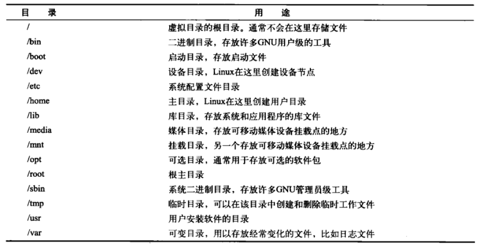

```{r setup, include=FALSE}
knitr::opts_chunk$set(echo = FALSE)
```


## Linux系统介绍
#### Linux可划分为以下四个部分：
  - Linux内核
    - 管理系统内存，软件程序，硬件设备和文件系统
  - GNU工具组件
    - Linux shell属于这一类
  - 图形化桌面环境
  - 应用软件


## Linux shell的功能
  - 启动程序，管理文件系统上的文件，管理进程
  - 核心是命令提示符，允许输入文本命令，在内核中执行后返回结果
  - 可以将shell命令放入文件中作为程序执行，称作shell脚本
  - 有多种Linux shell，默认为bash shell


## Bash shell introduction (Demo)
- 启动shell
  - 通常实在用户登录终端时启动
  - 自动处理用户主目录下.bashrc文件中的命令
- shell提示符
  - PS1：控制默认命令行提示符的格式
  - PS2：控制后续命令行提示符的格式
- 使用man查询手册条目
- Linux文件系统
  - 储存在单个目录结构中
  - root根目录
  - 正斜线（/）划分目录
  
  
## Bash shell introduction (Continued)
- 常见Linux目录名称
```{r, out.width = "800px", echo = F}

```


## Bash shell introduction (Continued)
- 遍历目录
  - 绝对路径：以代表根目录的正斜线（/）开头
  - 相对路径：
    - 以子目录名或者
    - 当前目录特殊字符(.)或者
    - 父目录特殊字符(..)开头
- 文件
  ```
  ls
  ls -F
  ls -a
  ls -l
  touch file # create a new empty file
  cp source destination # copy
  mv file1 file2 # rename
  rm file1 # remove
  ```


## Bash shell introduction (Continued)
- 目录
  ```
 mkdir dir1 # create directory
 rm -rf dir1 # delete directory
  ```
- 查看文件内容

  ``` 
  cat
  more
  less
  
  head -n
  tail -n
  ```


## THANK YOU
- 参考资料
  - http://www.bioinformatics.babraham.ac.uk/training/Introduction%20to%20unix.pdf
  - Bash shell cheat sheet: https://learncodethehardway.org/unix/bash_cheat_sheet.pdf